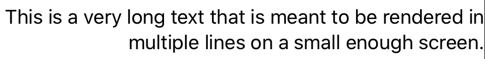

# Multi-line Text Alignment
A modifier that controls how multi-line text is aligned in text based views.

---

> UIKit equivalent: `UILabel.textColor: UIColor`, `UIImageView.tintColor: UIColor!`
>
> Available since: iOS 13.0, macOS 10.15, macOS Catalyst 13.0, tvOS 13.0, watchOS 6.0, Xcode 11.0

**Tags:** `Cascading`, `Rendered` _[What does this mean?](/modifiers/README.md#tags)_

### Declarations
```swift
func multilineTextAlignment(_ alignment: TextAlignment) -> some View

// `Text` provides a custom override.
func multilineTextAlignment(_ alignment: TextAlignment) -> some View
```

###### Arguments
1. `alignment: TextAlignment` - A `TextAlignment` enum case which specifies either a leading, trailing, or center alignment.

### Overview
This is a modifier which can be used to control how text that spans multiple lines is aligned. Provided text orientations are localized, according to the standard leading/trailing technique.

> **Note:** This is a **Cascading** modifier, which means it can be applied on container views to affect entire branches on the view hierarchy.

### Usage
Below is an example of how this view can be used to create a `Text` view which aligns its text on the trailing side of the screen.

```swift
Text("This is a very long text that is meant to be rendered in multiple lines on a small enough screen.")
    .multilineTextAlignment(.trailing)
```

### Visuals
The example above results text that will look as follows.


### Further Reading

###### Official Documentation
- [`View` version](https://developer.apple.com/documentation/swiftui/view/3365933-multilinetextalignment)
- [`Text` version](https://developer.apple.com/documentation/swiftui/text/3365517-multilinetextalignment)
- [`TextAlignment` enum](https://developer.apple.com/documentation/swiftui/textalignment)