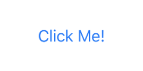
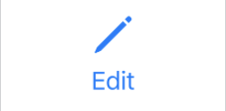

# Button
A control used for adding user interaction to your layout.

---

> UIKit/AppKit equivalents: `UIButton`/`NSButton`
> 
> Available since: iOS 13.0, macOS 10.15, macOS Catalyst 13.0, tvOS 13.0, watchOS 6.0, Xcode 11.0

### Declaration
```swift
struct Button<Label> where Label : View
```
> Where `Label` is a `View` that is used as the button's label.

### Overview
This is a control that is used to add interaction to your views and layouts. This control is usually "triggered" or clicked/tapped, upon which a callback provided by you is called, allowing the programmer to respond to the user interaction.

The method of “triggering” the button varies from platform to platform. For example, on iOS, iPadOS and watchOS a button is triggered by tapping it onscreen with the finger, whereas on tvOS it’s triggered by pressing “select” on an external remote while the button is focused. On macOS the button is triggered by left-clicking on it with a mouse.

##### Styling

`Button`s have built-in support for custom styling through their `ButtonStyle` and `PrimitiveButtonStyle` protocols. Once you have defined a type that conforms to one of these protocols, you can use an instance of your type as an argument to the `buttonStyle` modifier to apply that style to buttons in that branch of your layout.

### Usage
Here's an example of a simple button with a Text label that says `"Click Me!"`. The button will print the text `"Hello World"` to the output console when triggered.
```swift
Button("Click Me!") {
    print("Hello World")
}
```

Here's a more complicated example of a button, which renders a custom label, by placing an `Image` and a `Text` in a `VStack`. This one will toggle a boolean `editing` property when it is triggered.
```swift
// A more complicated example of a button.
Button(action: {
    // Example purposes.
    self.editing.toggle()
}) {
    VStack {
        Image(systemName: "pencil")
            .resizable()
            .scaledToFit()
            .aspectRatio(1, contentMode: .fit)
            .frame(width: 25)
        Text("Edit")
    }
}
.foregroundColor(.accentColor)
.imageScale(.large)
```

Note that it is also possible to link a button's action to a function instead of providing a callback. This allows you to take your buisness logic away from your view code as demonstrated below.
```swift
// A View's body property
var body: some View {
    // Instead of a callback, we provide a function name
    Button("Login", action: login)
}

// A function that performs the login operation
func login() { ... }
```

### Visuals

<!-- tabs:start -->

#### ** Simple **
This is a rendering of how the first example from the above code samples looks on iOS/iPadOS/MacOs Catalyst.



*Figure 1*

#### ** Complex **
This is a rendering of how the second example from the above code samples looks on iOS/iPadOS/MacOs Catalyst.



*Figure 2*

#### ** Form **
This is a rendering of how a button looks when placed inside a `Form` element on iOS/iPadOS/MacOs Catalyst.


*Figure 3*

<!-- tabs:end -->

## Topics

### Creating a button
---

#### Initialize with `LocalizedStringKey`

```swift
init(_ titleKey: LocalizedStringKey, action: @escaping () -> Void)
```
Creates a button with the given `LocalizedStringKey` as the label encased in a `Text` view. The provided closure will be called when the button is triggered.

###### Arguments
1. `titleKey: LocalizeStringKey` - The `LocalizedStringKey` that should be used as the text label for this button.
1. `action: @escaping () -> Void` - A closure that will be called everytime the `Button` is triggered.

###### Usage
Here's an example of how this initializer can be used to generate a simple button.
```swift
Button("Click Me!") {
    print("Hello World!")
}
```
The Button described above will render similar to what Figure 1 (above) depicts. When the button is triggered it will print the string "Hello World!" to the console.

---

#### Initialize with `String`

NEEDS REVIEW

```swift
init<S>(_ title: S, action: @escaping () -> Void) where S : StringProtocol
```

Creates a button with the given string/substring as the label of the button, encased in a `Text` view. The provided closure will be called when the button is triggered.

###### Arguments
1. `title: S` - The `String`/`Substring` that should be used as the text label for this button.
1. `action: @escaping () -> Void` - A closure that will be called everytime the `Button` is triggered.

###### Usage
The usage of this initialize is similar to the `LocalizedStringKey` initializer above.
```swift
Button("Click Me!") {
    print("Hello World!")
}
```

---

#### Initialize with closure

```swift
init(action: @escaping () -> Void, @ViewBuilder label: () -> Label)
```
> _Where `Label` is a `View`._
Creates a button. The first closure that is provided will be called when the button is triggered. The second closure must proide a `View` that is to be used as the `Button`'s label.

###### Arguments
1. `action: @escaping () -> Void` - A closure that will be called everytime the `Button` is triggered.
1. `@ViewBuilder label: () -> Label` - A closure that must return a `View` instance. The returned view will be used as the button's label.

###### Usage
Below is an exmaple of a button that is created using this initializer. When the button is pressed it will print `"Hello World!"` to the output console. It will rendere similar to what Figure 2 (above) dpicts.
```swift
Button(action: {
    print("Hello World!")
}) {
    VStack {
        Image(systemName: "pencil")
            .resizable()
            .scaledToFit()
            .aspectRatio(1, contentMode: .fit)
            .frame(width: 25)
        Text("Edit")
    }
}
```

---

#### Initialize with configuration

```swift
init(_ configuration: PrimitiveButtonStyleConfiguration)
```
> _Where `PrimitiveButtonStyleConfiguration.Label` is a `View`._

Creates a button with the given configuration. Most of the time you will only need to use this initializer when defining a custom `PrimitiveButtonStyle`.

###### Arguments
1. `configuration: PrimitiveButtonStyleConfiguration` - The configuration object that is given to you in the `makeBody` function of the `ButtonStyle`/`PrimitiveButtonStyle` protocol.

###### Usage
Below is a simple implementation of a `PrimitiveButtonStyle` protocol. It shows you how and in what scenario you would use this initializer.
```swift
// Define a custom style for Buttons.
struct RedPillStyle: PrimitiveButtonStyle {
    func makeBody(configuration: Self.Configuration) -> some View {
        // Configuration initializer being used.
        Button(configuration)
            .foregroundColor(.white)
            .padding()
            .background(Capsule().foregroundColor(.red))
    }
}

struct ContentView: View {
    var body: some View {
        Button("Click Me!") {
            print("Hello World!")
        }
        // Use our above defined style.
        .buttonStyle(RedPillStyle())
    }
}
```